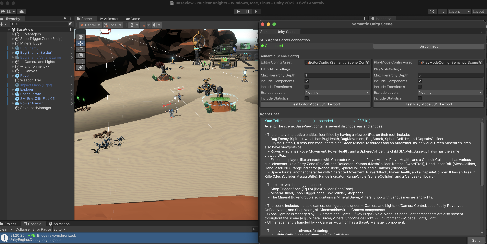

# Unity Semantic Bridge (USB)

Allows LLMs to understand Unity scenes efficiently through a structured representation of the scene graph based on the required use case.

## Architecture

1. Unity package in `/com.gamenami.unity-semantic-bridge` to be added to a Unity project via "add package from disk". 
2. Python Server in `/Server`. This waits for a handshake from the Unity package websocket client. The Unity package will send the Unity MPE port to the server which will then establish a websocket connection to Unity MPE.

## LLM Support

USB uses Gemini for the moment

Replace the `system_instruction` with the instructions for the game you want the LLM to play.