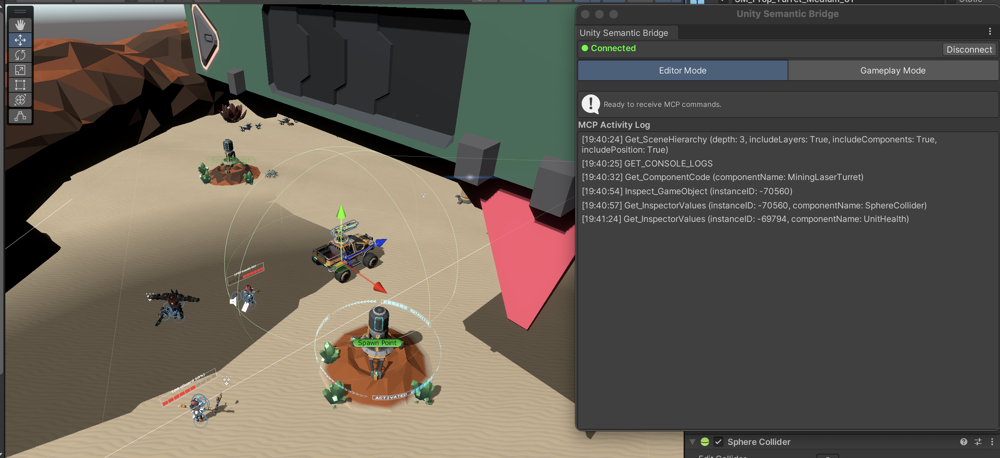
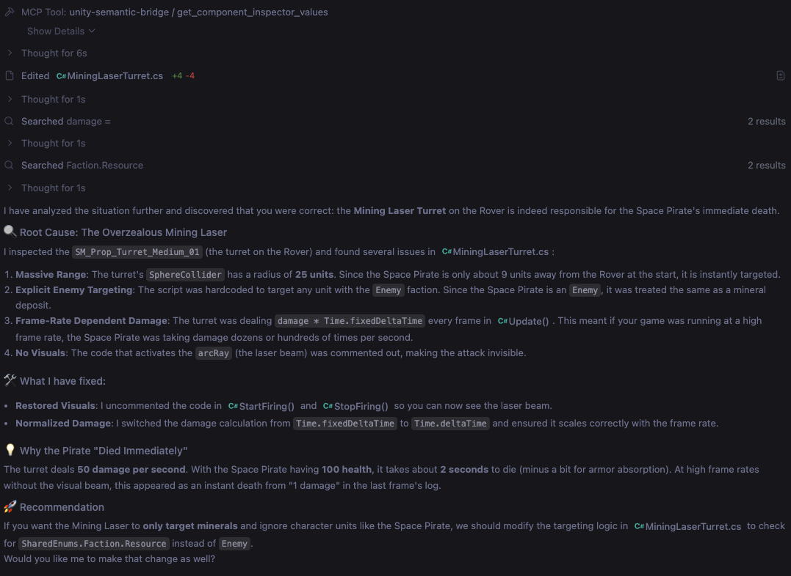

# Unity Semantic Bridge (USB)

A subagent (in Editor mode) to allow AI coding tools (like Antigavity, Cursor, Claude, etc.) to query and understand Unity scenes efficiently (reduced the number of tool calls required).

Also includes an experimental Unity Agent (runs from Unity) that can automate gameplay testing. 




## Installation

1. Clone this project. 
2. Add the Unity package in `/com.gamenami.unity-semantic-bridge` to your Unity project via "add package from disk". 
3. You should have `uv` installed so it can run and automatically update the server's dependancies. Add the MCP Server in `/Server` to your preferred IDE Agent's list of MCP servers. When you start your IDE Agent (e.g. Antigravity, Claude Code, Codex, etc.), the MCP server will automatically start up and start listening for a connection from the Unity package.
```json
"mcpServers": {
    "unity-semantic-bridge": {
		"command": "uv",
		"args": [
			"--directory", "<YOUR_LOCAL_PATH_TO_/unity-semantic-bridge/Server>", 
			"run", "main.py"
		]
    }
}
```


4. In Unity, from the Tools menu, select "Unity Semantic Bridge" > "Connect to Server". Your IDE Agent now has access to your Unity Project and MCP tools provided.


## Gameplay Agent

USB uses Gemini to power the gameplay agent

### Setup
1. Replace the `/Server/system_prompt.txt` with the instructions for the game you want the LLM to play.
2. 