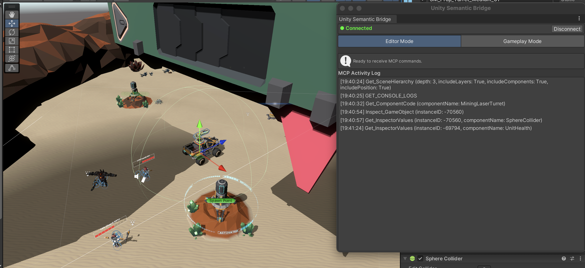

# Unity Semantic Bridge (USB)


A Unity MCP Bridge built for agents working alongside you in a live Editor session — not just querying a static project. Token-efficient tools give your agent visibility into what changed in the scene while you were both working in it.



## Features

- Optimized scene heirarchy query and gameobject inspection tools with workflow hints for agents - more token efficient than official Unity CLI tool
- In Editor connection status and auto reconnect through domain reloads. 
- Not tied to Unity Licensing - Runs 100% local. No need to reauthenticate when token expires
- Dedicated tools for agent to see human actions and changes
- Dedicated tools for working with Scriptable objects (error prone if agent uses bash to work SOs directly)
- In Editor MCP log so you can see what tools are called
- Dedicated Lighting tools for URP projects

## Prerequisites

- Unity 2022.3–6.3.
- [Git](https://git-scm.com/) on `PATH` and [uv](https://docs.astral.sh/uv/getting-started/installation/) for Python setup.

## Installation

Install both the Unity package and the Python MCP server:

1. In Unity, open **Window > Package Manager > + > Add package from Git URL**
   and paste:

   ```text
   https://github.com/Programalyst/unity-semantic-bridge.git?path=/com.gamenami.unity-semantic-bridge
   ```

2. Clone the matching Python server and install its dependencies:

   ```sh
   git clone https://github.com/Programalyst/unity-semantic-bridge.git
   uv --directory unity-semantic-bridge/mcp-editor-bridge sync --locked
   ```

3. Register the server with your MCP client. For Codex, replace the path below
   with your clone's absolute path:

   ```sh
   codex mcp add unity-semantic-bridge -- uv --directory "/absolute/path/to/unity-semantic-bridge/mcp-editor-bridge" run main.py
   ```

   [Other client configurations](docs/installation.md#clients-using-json-configuration).

4. In Unity, open **Tools > Unity Semantic Bridge > Start HTTP Listener**, then
   start or reconnect your MCP client. The client launches Python over stdio;
   Python connects to Unity on port 1073.

Commit both `Packages/manifest.json` and `Packages/packages-lock.json` to share
the installation. Keep your MCP client's local clone path out of shared settings.

For upgrades, local-to-Git migration, or bridge development using **Add package
from disk**, see the [installation reference](docs/installation.md). Do not commit
personal absolute package paths. An API key is only needed for
[optional lighting diagnostics](mcp-editor-bridge/LightingAgent/README.md).

## Available Tools

**Human-Agent Cowork**
- `get_recent_unity_events` — Returns Unity Editor events (`hierarchy`/`selection`/`play-mode`/`console`/`objectChanged` via `ObjectChangeEvents.changesPublished`) pushed since a time window — use to see human edits, `add_component`/`remove_component`/`set_field_values` etc.
- `notify_unity` — Sends a message to the Unity Editor chat window (`BridgeRelay.OnAgentMessage`).

**Project & Settings**
- `get_project_settings` — Returns Unity Project Settings as JSON. Selectively fetch `core` (Unity version, build target), `rendering` (URP asset, color space, MSAA), `input` (Input Handling, `inputactions` assets), `ui` (uGUI vs UI Toolkit counts), `scripting` (API level, define symbols, backend), `tags_layers`. The `editor_prefs` section reports the current Interaction Mode, stored idle time, and restore availability; these are user-level Editor preferences.
- `set_editor_throttling` — Allows agent to set no_throttling for long running tasks. Speeds up agentic flows by keeping Editor tick rate un-throttled when unfocused. 

**Scene & GameObject Inspection**
- `get_scene_hierarchy` — Returns the scene as a list of GameObjects with paths and instance IDs. Usually the first tool to call. Supports depth limiting, a node cap with truncation reporting (for large scenes), optional filtering to only main-camera-visible objects, and `root_instance_id` subtree queries.
- `get_gameobject_tree` — Full hierarchy under a specific GameObject (faster than `get_scene_hierarchy` for rigs; avoids `SkinnedMeshRenderer` pruning).
- `inspect_gameobject` — Detailed inspection of a GameObject including components and public fields (uses `ComponentInspector` with expanded `Generic` structs).
- `get_component_inspector_values` — All serialized field values visible in the Inspector for a specific component (live Editor values, expands `RigBuilder`/`Rig`/`*Constraint.m_Data`/`Transform.m_LocalRotation` as structured `quat`+`euler`).
- `get_component_code` — Locates and returns the full C# source for a named component (`MonoScript` via `AssetDatabase`).
- `get_physics_layers` — Physics layer collision matrix (`Physics.GetIgnoreLayerCollision`).

**Scene & GameObject Authoring (Hierarchy & Rigging)**
- `create_gameobject` — Creates a new `GameObject` (`new GameObject(name)`) with `Undo.RegisterCreatedObjectUndo`, optional `parentInstanceId` via `SetParent(parent,false)`, and optional `localPosition`/`localRotation` (`{x,y,z,w}` or `{euler}`) / `localScale`. Returns `{instanceId,path}`.
- `duplicate_gameobject` — Duplicates a hierarchy via `Instantiate` + `Undo.RegisterCreatedObjectUndo` (use for cloning whole rig layers, e.g. `Rig Layer (Rifle Idle)`). Returns `{instanceId,path}`.
- `set_parent` — Reparents via `Undo.SetTransformParent` (or `RegisterCompleteObjectUndo`+`SetParent` when `keepWorldPosition:true`). Pass `null` to unparent to root.
- `delete_gameobject` — Deletes a `GameObject` via `Undo.DestroyObjectImmediate` (supports Undo).
- `copy_component` — Deep-copies a component via `Undo.AddComponent` + `EditorUtility.CopySerialized` (required for Animation Rigging `Constraint.data` structs where `m_Data: [Generic]` cannot be rebuilt via `set_field_values`). Returns `{targetComponentIndex,targetInstanceId}`.
- `add_component` — Adds a component by `instance_id` (`Type.GetType` + assembly fallback, respects `allowDuplicate`).
- `remove_component` — Removes a component by `instance_id` (`Undo.DestroyObjectImmediate`).
- `set_field_values` — Sets one or more serialized field values via `SerializedObject`/`FindProperty` + `Undo.RecordObject` (supports primitives, enums as strings, `Vector2/3`, `Quaternion`, `Color`, `ObjectReference` as `instanceId`, `Generic`/`Array` for `RigBuilder`/`Constraint` data).

**Assets & ScriptableObjects**
- `find_unity_files` — Finds assets in Unity via `AssetDatabase.FindAssets` (`t:Prefab`, `l:Label`, etc.), default `folders:['Assets']`.
- `find_asset_references` — Finds assets/scenes referencing a specific asset path (`AssetDatabase.GetDependencies`).
- `get_project_tree` — Project folder structure from a path (`AssetDatabase.GetSubFolders` + direct-file filter).
- `write_unity_script` — Creates/overwrites a C# script (`Assets/...cs`) and triggers recompilation (`AssetDatabase.ImportAsset`/`Refresh`, `CONFIRM_REQUIRED` pattern).
- `create_scriptable_object` — Creates a `ScriptableObject` asset atomically without `write_unity_script`: `Type.GetType` + assembly fallback, `ScriptableObject.CreateInstance`, field init via `SerializedObject` (primitives, enums as `"cross"`→`UnitId.cross`, `Vector3` `{x,y,z}`, `Object` refs as `instanceId`/`guid`/`{fileID,guid}`), `Undo.RegisterCreatedObjectUndo` + `AssetDatabase.CreateAsset/SaveAssets/Refresh`. Validates `Assets/` + `.asset`, parent folder exists, `ScriptableObject` subclass, `CONFIRM_REQUIRED` on overwrite. Returns `{instanceId,guid,path}`.
- `delete_asset` — Deletes an asset via `AssetDatabase.DeleteAsset` (supports Undo, validates `Assets/`).
- `refresh_assets` — No-argument asset refresh after external disk edits; Unity decides whether compilation/reload is needed. See [refresh workflow](mcp-editor-bridge/README.md#refreshing-external-file-edits).
- `get_compilation_status` — Non-blocking snapshot (`PENDING`/`SUCCESS`/`FAILED`/`NO_COMPILATION`/`UNKNOWN`) — poll after `write_unity_script` or `refresh_assets`.

**Editor & Runtime**
- `get_screenshot` — Captures `game` (`Camera.main`) or `scene` (Scene view) as JPEG; `scene` can `Frame` a `focus_instance_id` bounds before capture.
- `set_play_mode` — Enters/exits Play Mode (`EditorApplication.isPlaying` via `delayCall`).
- `get_console_logs` / `clear_console_logs` — Read last 10 errors/warnings via `LogEntries` reflection or clear (`LogEntries.Clear`).

**Lighting Diagnostics**
- `get_lights_affecting_object` — Lights within range of a target object using actual bounds distance, per-light `type`/`intensity`/`range`/`cullingMask` (uses `GetLightsAffectingObject`).
- `get_urp_pipeline_settings` — URP asset’s current render path setting (`GetUrpPipelineSettings`).
- `diagnose_lighting_issue` — Autonomous diagnostic subagent (lights → URP → renderer/materials) via `core.llm_provider`; see `LightingAgent/README.md`. Requires `LIGHTING_LLM_PROVIDER`/`MODEL` + API key.


## Known Limitations (for Agents using this tool to read)

- **Unity instance IDs are not stable across script recompiles or domain reloads.** Any C# change invalidates previously-fetched instance IDs — re-run `get_scene_hierarchy` after recompiling before reusing an ID from an earlier call.
- **The Editor connection is single-flight.** Only one MCP request is processed at a time; overlapping calls queue rather than run concurrently, since Unity's Editor-side message handling is inherently serial.

## Imported model inspection

Use `inspect_model_asset(path, include_details=False)` to read mesh IDs, bounds,
geometry counts, imported transforms, importer scale/axis settings, material slots
and outgoing dependencies without changing assets or scenes. See
[model inspection and deletion-reference assessment](docs/model-inspection.md)
for coordinate-space definitions, examples and tests.
